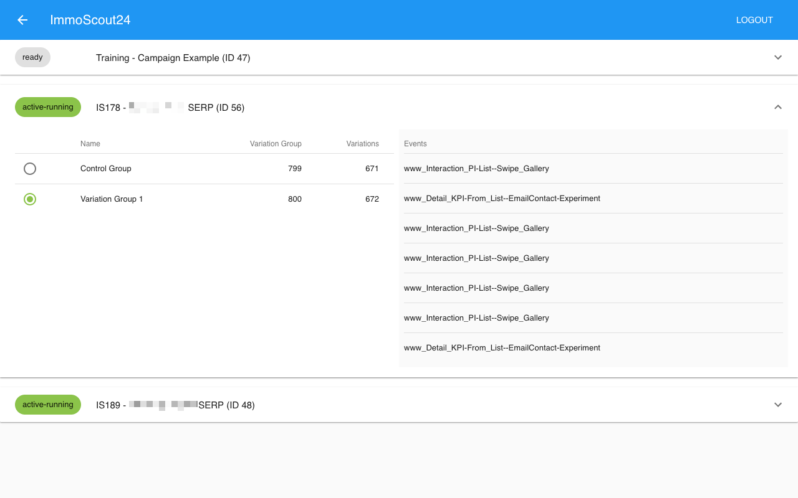

## SiteSpect QA
Chrome extension to simplify QA process while working with [SiteSpect](https://www.sitespect.com/). Awesome for fast variation switching in preview sessions without having to switch tabs or copying preview links.

- One click variation switching in experiements and personalization
- Listing all counted tracking events
- Test draft variations
- The stats stay fine. While using the extension, no stats are generated and no events are recorded. 
- DevTools Extension

## Installation
- [Chrome Web Store](https://chrome.google.com/webstore/detail/sitespect-qa/plenaoidopfljcbahkglkgcliijjfhnb)



## Extension permissions 
This extensions need to be able to access all URLs because of individual URLs, including custom SiteSpect admin. Not satisfied with the 'Read and change all your data on the websites that you visit'? Build your own one in some simple steps

1. Clone (or fork) this repository
1. Open the Terminal, navigate to the repository directory and run `npm i`
1. Open the [public/manifest.json](public/manifest.json) and make two changes:
   - `"name"` -> change the name field to something unique, like including your company
   - `"permissions"` -> delte the `"<all_urls>"` permission and add all your websites AND your SiteSpect admin URL with wildcards (see the example below)
1. run `npm run pack`, this generates an `extension.zip` in the repo root folder
1. Upload the extension to the [chrome web store](https://chrome.google.com/webstore/developer/dashboard) - you need a Google developer account for this (free)
1. In the publish form at the "Visibility options" (very bottom) select the **Unlisted** option to make it invisible for public users. You then can share the link within your company.
1. Hit 'Publish' - done. (It may take Google up to one hour, to publish).


### Example changes for your manifest.json
Note the wildcards `*` in the URLs.
```js
{
  // ...
  "name": "Awesome Corp. - SiteSpect QA",

  "permissions": [
    "https://*.awesome-corp.com/",
    "https://sitespect.awesome-corp-admin.com/",
    "tabs",
    "webRequest",
    "webRequestBlocking"
  ],
  // ...
}
```

## License
- [MIT](LICENSE)